# ResearchPro - Advanced Multimodal RAG System
[](https://www.python.org/)
[](https://fastapi.tiangolo.com/)
[](https://langchain.com/)
[](https://streamlit.io/)
## 📋 Table of Contents
- [Problem Statement](#-problem-statement)
- [Solution Approach](#-solution-approach)
- [Tech Stack](#-tech-stack)
- [Architecture Overview](#-architecture-overview)
- [API Reference](#-api-reference)
- [LLM Integration Points](#-llm-integration-points)
- [Installation & Setup](#-installation--setup)
- [Usage](#-usage)
---
## 🎯 Problem Statement
Academic researchers face significant challenges when analyzing research papers:
### Key Challenges
1. **Multimodal Content Complexity**: Research papers contain text, tables, charts, and images that are difficult to query holistically
2. **Information Fragmentation**: Critical data is scattered across different modalities (tables with numerical results, figures with visual insights, text with explanations)
3. **Context Loss**: Traditional RAG systems treat documents as pure text, losing structured data from tables and visual information from images
4. **Query Ambiguity**: Follow-up questions lack context from previous conversation turns
5. **Retrieval Precision**: Single retrieval methods (semantic or keyword) miss relevant information
6. **Table Understanding**: Extracting specific numerical data and trends from tables requires specialized processing
### Real-World Impact
Researchers spend hours manually searching through PDFs for specific data points, cross-referencing tables, and interpreting figures—tasks that should be automated.
---
## 💡 Solution Approach
ResearchPro addresses these challenges through an **Advanced Multimodal RAG Pipeline** with the following innovations:
### 1. **Intelligent Multimodal Processing**
- **Selective Hi-Res Scanning**: Fast scan detects pages with tables/images, then applies expensive hi-res processing only where needed
- **Parallel Image Analysis**: Uses vision models to generate textual descriptions of all images concurrently (4 workers)
- **Table Structure Preservation**: Extracts tables as HTML to maintain structure and relationships
### 2. **Hybrid Retrieval Strategy**
- **Semantic Search (FAISS)**: Captures conceptual similarity using embeddings
- **Keyword Search (BM25)**: Ensures exact term matches aren't missed
- **Ensemble Fusion**: Combines both approaches with 50/50 weighting
- **Cross-Encoder Reranking**: Refines top candidates using query-document pair scoring
### 3. **Context-Aware Querying**
- **Conversational Memory**: Maintains session-based chat history
- **Query Reformulation**: Rewrites vague follow-ups into self-contained questions using chat history
- **Multimodal Context Injection**: Automatically adds relevant tables and image descriptions to queries
### 4. **Lazy Summarization with Caching**
- **On-Demand Summaries**: Generates AI summaries only for retrieved chunks with tables/images
- **Page-Level Caching**: Avoids redundant LLM calls for repeated queries
- **Integrated Summaries**: Combines text, table data, and image insights into searchable summaries
---
## 🛠 Tech Stack
### **Frontend**
| Component | Technology | Purpose |
|-----------|-----------|---------|
| UI Framework | **Streamlit 1.49** | Interactive chat interface |
| Session Management | **UUID** | Unique session tracking |
| HTTP Client | **Requests** | API communication |
### **Backend**
| Component | Technology | Purpose |
|-----------|-----------|---------|
| API Framework | **FastAPI 0.116** | REST API endpoints |
| Orchestration | **LangChain 0.3** | RAG pipeline management |
| Document Parsing | **Unstructured 0.18** | PDF extraction (text, tables, images) |
| Vector Database | **FAISS 1.12** | Semantic similarity search |
| Keyword Search | **BM25Retriever** | Syntactic retrieval |
### **AI Models**
| Model Type | Provider | Model Name | Purpose |
|------------|----------|------------|---------|
| Main LLM | **Groq** | `openai/gpt-oss-20b` | Question answering |
| Summary LLM | **Groq** | `llama-3.3-70b-versatile` | Multimodal summarization |
| Vision Model | **Groq** | `llama-4-scout-17b-16e-instruct` | Image description |
| Embeddings | **HuggingFace** | `BAAI/bge-small-en-v1.5` | Text embeddings |
| Reranker | **HuggingFace** | `cross-encoder/ms-marco-MiniLM-L-6-v2` | Result reranking |
### **Core Libraries**
- **langchain-groq**: Groq LLM integration
- **langchain-huggingface**: Embeddings and cross-encoders
- **sentence-transformers**: Embedding models
- **unstructured[pdf]**: Advanced PDF parsing
- **pytesseract**: OCR for scanned documents
- **opencv-python**: Image processing
---
## 🏗 Architecture Overview

```mermaid
graph TB
    User[👤 User]
    
    subgraph Frontend["🖥 Frontend (Streamlit)"]
        UI[Chat Interface]
        Session[Session Manager]
    end
    
    subgraph Backend["⚙️ Backend (FastAPI)"]
        API[main.py - API Endpoints]
        
        subgraph Services["📦 Services"]
            DocProc[DocumentProcessor]
            Vision[MultimodalProcessor]
            RAG[RAG_Pipeline]
            Rerank[ReRanker_Model]
        end
        
        Utils[SessionManager]
        Config[config.py]
    end
    
    subgraph External["☁️ External APIs"]
        Groq[Groq API]
        HF[HuggingFace Models]
    end
    
    User --> UI
    UI --> API
    API --> DocProc
    API --> RAG
    API --> Rerank
    API --> Utils
    DocProc --> Vision
    DocProc --> Config
    RAG --> Config
    Config --> Groq
    Config --> HF
```

### **Component Responsibilities**
#### **1. MultimodalProcessor** (`vision_service.py`)
- Detects pages with tables/images via fast scan
- Applies hi-res processing selectively
- Describes images using vision model (parallel processing)
- Chunks documents by title
- Generates AI summaries integrating text + tables + images
#### **2. DocumentProcessor** (`document_service.py`)
- Loads and processes PDFs
- Creates FAISS vectorstore and BM25 retriever
- Extracts tables and images for separate indexing
- Provides query-specific table/image context
#### **3. RAG_Pipeline** (`rag_service.py`)
- Creates hybrid retriever (BM25 + FAISS)
- Manages conversational chain with history
- Implements query reformulation
- Orchestrates context enhancement with tables/images
- Caches summaries by page number
#### **4. ReRanker_Model** (`reranker.py`)
- Wraps hybrid retriever with cross-encoder
- Reranks candidates to top 3 most relevant
#### **5. SessionManager** (`session_manager.py`)
- Stores chat history per session ID
- Enables conversational context retention
---
## 📡 API Reference
### **Base URL**
```
http://127.0.0.1:8000
```
---
### **GET /**
**Description**: Root endpoint with API information
**Response**:
```json
{
  "message": "Welcome to the Advanced Research Assistant",
  "endpoints": {
    "POST /upload_file": "Upload a document for processing",
    "POST /query": "Query the uploaded documents"
  }
}
```
---
### **POST /upload_file**
**Description**: Upload and process a PDF document with multimodal extraction
**Request**:
- **Content-Type**: `multipart/form-data`
- **Body**: 
  - `file`: PDF file (required)
**Processing Pipeline**:
1. Save file to temporary directory
2. **Fast scan** to detect pages with tables/images
3. **Hi-res scan** on complex pages only
4. **Parallel image analysis** (4 workers) using vision model
5. Extract tables as HTML structures
6. Create **FAISS vectorstore** (semantic search)
7. Create **BM25 retriever** (keyword search)
8. Build **hybrid retriever** (50/50 ensemble)
9. Apply **cross-encoder reranking** (top 3)
10. Initialize **conversational RAG chain**
11. Cleanup temporary file
**Success Response (200)**:
```json
{
  "message": "File uploaded and retriever initialized successfully.",
  "stats": {
    "documents": 45,
    "tables": 8,
    "images": 12
  }
}
```
**Error Response (500)**:
```json
{
  "detail": "Error processing file: {error_message}"
}
```
**LLM Calls During Upload**:
- **Vision Model**: Called once per image to generate descriptions (parallel)
- **No LLM calls** for text processing (embeddings only)
---
### **POST /query**
**Description**: Query the processed document with conversational context
**Request**:
- **Content-Type**: `application/json`
- **Body**:
```json
{
  "query": "What are the main findings in Table 2?",
  "session_id": "optional_session_id"  // defaults to "default_session"
}
```
**Processing Pipeline**:
1. **Hybrid retrieval**: BM25 + FAISS return ~5 candidates each
2. **Reranking**: Cross-encoder scores all candidates, returns top 3
3. **Summarization** (if needed):
   - Check if retrieved docs have tables/images
   - Check summary cache by page number
   - If cache miss: Generate AI summary with `llm_summarize`
   - Cache summary for future queries
4. **Table context injection**: Extract relevant tables matching query keywords
5. **Image context injection**: Add image descriptions if query contains visual keywords
6. **Enhanced input construction**: Combine query + summaries + tables + images
7. **Query reformulation**: Rewrite query using chat history (LLM call)
8. **Answer generation**: Generate final answer with all context (LLM call)
9. **Session update**: Store query and answer in chat history
**Success Response (200)**:
```json
{
  "response": "Table 2 shows that accuracy improved from 78.3% to 92.1% after applying the proposed method..."
}
```
**Error Response (500)**:
```json
{
  "detail": "Error processing query: {error_message}"
}
```
**LLM Calls During Query**:
- **Summary LLM** (`llm_summarize`): 0-3 calls (only for uncached multimodal chunks)
- **Reformulation LLM** (`llm`): 1 call (query reformulation with history)
- **Answer LLM** (`llm`): 1 call (final answer generation)
---
### **DELETE /delete**
**Description**: Clear vectorstore and all session histories
**Processing**:
1. Clear vectorstore in RAG pipeline
2. Clear vectorstore in document processor
3. Clear all retrievers and chains
4. Clear extracted tables and images
5. Clear all session chat histories
**Success Response (200)**:
```json
{
  "message": "Vectorstore and sessions cleared"
}
```
**Error Response (500)**:
```json
{
  "detail": "Error clearing vectorstore: {error_message}"
}
```
---
## 🤖 LLM Integration Points
### **Overview of LLM Usage**
ResearchPro uses **3 different LLM models** for specialized tasks, optimizing for quality, speed, and cost.
---
### **1. Vision Model** (`llama-4-scout-17b-16e-instruct`)
**When Called**: During document upload, for each image in the PDF
**Purpose**: Generate textual descriptions of images/figures/charts
**Implementation Location**: `vision_service.py` → `describe_image()`
**Process**:
```python
# Called in parallel (4 workers) for all images
response = groq_client.chat.completions.create(
    model="meta-llama/llama-4-scout-17b-16e-instruct",
    messages=[{
        "role": "user",
        "content": [
            {"type": "text", "text": "Describe this image in detail."},
            {"type": "image_url", "image_url": {"url": image_url}}
        ]
    }],
    max_tokens=300,
    temperature=0.1
)
```
**Why This Model**: Specialized vision-language model optimized for image understanding
**Optimization**:
- **Caching**: Results cached by base64 hash to avoid re-processing same images
- **Parallel Processing**: ThreadPoolExecutor with 4 workers
- **Size Limit**: Images > 2MB skipped to avoid timeouts
- **Truncation**: Descriptions limited to 500 characters
**Example Output**:
```
"A bar chart comparing accuracy metrics across three methods. Method A shows 78%, Method B shows 85%, and the proposed method achieves 92%. Error bars indicate standard deviation."
```
---
### **2. Summary LLM** (`llama-3.3-70b-versatile`)
**When Called**: During query processing, when retrieved chunks contain tables or images
**Purpose**: Create searchable summaries integrating text, tables, and image descriptions
**Implementation Location**: `vision_service.py` → `_generate_ai_summary()`
**Process**:
```python
# Called on-demand during query processing
prompt = """You are a concise research summarizer. Create a brief, searchable summary 
integrating text, tables, and visual elements.
SUMMARY RULES:
- Extract core findings, methodology, and key results from text
- Convert tables to brief data statements with exact numbers
- Synthesize key insights from image descriptions
- Preserve domain terms, metric names, and visual insights
- Never invent data—only use what's explicitly shown
- Keep under 200 words
CONTENT:
{text + tables + image_descriptions}
SUMMARY (direct, no formatting tags):"""
response = llm_summarize.invoke([HumanMessage(content=prompt)])
```
**Why This Model**: Powerful 70B model for accurate data extraction and synthesis
**Optimization**:
- **Lazy Evaluation**: Only called for retrieved chunks with multimodal content
- **Page-Level Caching**: Summaries cached by page number in `summary_cache` dict
- **Token Limits**: `max_tokens=512` (≈200 words)
- **Low Temperature**: `temperature=0.1` for factual consistency
**Example Output**:
```
"This section presents experimental results comparing three approaches. Table 1 shows 
accuracy metrics: baseline (78.3%), method A (85.7%), and proposed method (92.1%). 
The bar chart visualizes these improvements, with error bars indicating ±2.3% standard 
deviation. The proposed method achieves 13.8% improvement over baseline, statistically 
significant at p<0.01."
```
**Trigger Conditions**:
```python
# Only called if:
if doc.metadata.get("has_tables") or doc.metadata.get("has_images"):
    if page not in self.summary_cache:  # Cache miss
        summary = _generate_ai_summary(text, tables, images)
        self.summary_cache[page] = summary
```
---
### **3. Main LLM** (`openai/gpt-oss-20b`)
**When Called**: During every query, twice per request
**Purpose**: 
- **Call 1**: Query reformulation using chat history
- **Call 2**: Final answer generation with full context
**Implementation Location**: `rag_service.py` → `query()`
---
#### **Call 1: Query Reformulation**
**Purpose**: Rewrite user query to be self-contained using conversation history
**Prompt** (`reformulation_prompt`):
```python
system_prompt = """
You are a research question reformulator for academic document analysis.
Given the conversation history and the latest user query, rewrite the query 
into a clear, self-contained research question.
Guidelines:
- Preserve the user's intent completely.
- Expand abbreviations or vague references (e.g., "it", "they", "the table") using chat history.
- If the question involves data, tables, statistics, or numerical information, make that explicit.
- If referring to previous tables or data, include that context in the reformulation.
- Do NOT answer the question - only reformulate it.
- If the question is already clear and standalone, return it unchanged.
Examples:
- "What does it show?" → "What data does the table on page X show?"
- "Compare them" → "Compare the results shown in Table 1 and Table 2"
"""
```
**Example Transformation**:
```
User History:
  User: "What are the main findings?"
  Assistant: "The main findings show accuracy improved from 78% to 92%..."
  User: "What about the baseline?"
Reformulated Query:
  "What was the baseline accuracy before the proposed method was applied?"
```
**Why Needed**: Enables natural follow-up questions without losing context
---
#### **Call 2: Answer Generation**
**Purpose**: Generate comprehensive answer using all available context
**Input Construction**:
```python
enhanced_input = f"""
{original_query}
SUMMARIZED CONTEXT:
{summarized_chunks}
=== RELEVANT TABLES FROM DOCUMENT ===
[Table 1 - Page 5]
<table HTML with data>
=== IMAGE ANALYSIS ===
[Image 1 — Page 6]
A bar chart showing accuracy comparison: baseline 78%, method A 85%, proposed 92%
"""
```
**Prompt** (`answer_prompt`):
```python
system_prompt = """
You are an expert research assistant specialized in analyzing academic papers, 
with particular expertise in interpreting tables, charts, and quantitative data.
CRITICAL INSTRUCTIONS:
1. **Base answers ONLY on provided context** - never fabricate data or references.
2. **When tables are present:**
   - Carefully analyze the table structure, headers, and data
   - Extract specific numbers, trends, and comparisons
   - Explain what the data shows in clear, accessible language
   - Note any patterns, outliers, or significant findings
3. **For data-related questions:**
   - Cite specific values from tables when available
   - Compare multiple data points if relevant
   - Explain the significance of the numbers
4. **Structure your response:**
   - Start with a direct answer to the question
   - Support with specific data from tables/text
   - Provide interpretation and context
   - Mention limitations if data is incomplete
5. **Maintain academic rigor:**
   - Use precise language for quantitative information
   - Distinguish between facts (from context) and interpretation
   - If context lacks information, clearly state so
6. **For tables/charts specifically:**
   - Describe what type of data is presented
   - Identify key comparisons being made
   - Note any trends or relationships visible in the data
   - Reference the page number when citing table data
Context (includes text passages and table data):
{context}
"""
```
**Configuration**:
```python
llm = ChatGroq(
    model="openai/gpt-oss-20b",
    max_tokens=2048,      # Detailed answers
    temperature=0.1,      # Factual consistency
    timeout=30
)
```
**Why This Model**: Fast, cost-effective, and accurate for question-answering
**Example Output**:
```
The baseline accuracy before applying the proposed method was 78.3%, as shown in 
Table 1 on page 5. This baseline represents the performance of the standard approach 
without any modifications. The proposed method improved this to 92.1%, representing 
a 13.8 percentage point improvement. The bar chart on page 6 visualizes this comparison, 
showing the baseline as the leftmost bar with error bars indicating ±2.3% standard deviation.
```
---
### **LLM Call Summary Table**
| Stage | Model | Purpose | Frequency | Caching | Token Limit |
|-------|-------|---------|-----------|---------|-------------|
| **Upload** | Vision Model | Image description | Once per image | Yes (by base64) | 300 |
| **Query** | Summary LLM | Multimodal summarization | 0-3 per query | Yes (by page) | 512 |
| **Query** | Main LLM | Query reformulation | 1 per query | No | 2048 |
| **Query** | Main LLM | Answer generation | 1 per query | No | 2048 |
---
### **LLM Optimization Strategies**
#### **1. Caching**
```python
# Image descriptions cached indefinitely
self.image_cache[base64_img] = description
# Summaries cached per session
self.summary_cache[page_number] = summary
```
#### **2. Lazy Evaluation**
```python
# Summaries only generated for retrieved chunks with multimodal content
if doc.metadata.get("has_tables") or doc.metadata.get("has_images"):
    if page not in self.summary_cache:
        summary = _generate_ai_summary(...)
```
#### **3. Parallel Processing**
```python
# All images processed concurrently
with ThreadPoolExecutor(max_workers=4) as executor:
    futures = {executor.submit(self.describe_image, img): img 
               for img in all_images}
```
#### **4. Token Limits**
- Vision: 300 tokens (descriptions truncated to 500 chars)
- Summary: 512 tokens (≈200 words)
- Main: 2048 tokens (detailed answers)
#### **5. Temperature Control**
- Vision: 0.1 (factual descriptions)
- Summary: 0.1 (accurate data extraction)
- Main: 0.1 (consistent answers)
---
## 🚀 Installation & Setup
### **Prerequisites**
- Python 3.9+
- Groq API Key ([Get one here](https://console.groq.com/))
### **1. Clone Repository**
```bash
git clone <repository-url>
cd ResearchPro_AdvancedRAG
```
### **2. Create Virtual Environment**
```bash
python -m venv venv
venv\Scripts\activate  # Windows
# source venv/bin/activate  # Linux/Mac
```
### **3. Install Dependencies**
```bash
pip install -r requirements.txt
```
### **4. Configure Environment**
Create a `.env` file in the root directory:
```env
GROQ_API_KEY=your_groq_api_key_here
```
### **5. Start Backend Server**
```bash
uvicorn backend.app.main:app --reload --host 127.0.0.1 --port 8000
```
### **6. Start Frontend (New Terminal)**
```bash
streamlit run frontend/streamlit_app.py
```
### **7. Access Application**
- **Frontend**: http://localhost:8501
- **API Docs**: http://127.0.0.1:8000/docs
---
## 📖 Usage
### **1. Upload Document**
1. Click "Browse files" in the sidebar
2. Select a PDF research paper
3. Click "Process Document"
4. Wait for processing to complete (shows document stats)
### **2. Ask Questions**
```
Example queries:
- "What is the main contribution of this paper?"
- "Summarize the methodology used"
- "What are the accuracy results in Table 2?"
- "Describe the architecture shown in Figure 3"
- "Compare the baseline and proposed method"
```
### **3. Follow-Up Questions**
```
User: "What are the main findings?"
Assistant: "The main findings show accuracy improved from 78% to 92%..."
User: "How does that compare to the baseline?"
Assistant: "The baseline achieved 78.3% accuracy, so the proposed method 
           represents a 13.8 percentage point improvement..."
```
### **4. Reset/Clear**
- **New Chat**: Clears conversation history, keeps document
- **Clear All**: Clears conversation and deletes vectorstore
- **Reset Vectorstore**: Removes document, ready for new upload
---
## 🔍 Key Features
### ✅ **Multimodal Understanding**
- Extracts and analyzes text, tables, and images
- Generates AI descriptions of figures and charts
- Preserves table structure for accurate data extraction
### ✅ **Hybrid Retrieval**
- Combines semantic (FAISS) and keyword (BM25) search
- Cross-encoder reranking for precision
- Returns top 3 most relevant chunks
### ✅ **Conversational Context**
- Session-based chat history
- Query reformulation using conversation context
- Natural follow-up questions
### ✅ **Intelligent Optimization**
- Selective hi-res processing (only complex pages)
- Parallel image analysis (4 workers)
- Lazy summarization with caching
- Token-efficient prompts
### ✅ **Academic Focus**
- Specialized prompts for research paper analysis
- Table and data interpretation expertise
- Citation of page numbers and sources
- Factual consistency (low temperature)
---
## 📊 Performance Characteristics
| Metric | Value | Notes |
|--------|-------|-------|
| **Upload Time** | ~30-60s | Depends on document size and complexity |
| **Query Latency** | ~2-5s | First query may be slower (summary generation) |
| **Cached Query** | ~1-2s | Subsequent queries use cached summaries |
| **Image Processing** | ~2-4s per image | Parallel processing (4 concurrent) |
| **Memory Usage** | ~2-4 GB | Includes FAISS index and models |
---
## 🤝 Contributing
Contributions are welcome! Please follow these steps:
1. Fork the repository
2. Create a feature branch (`git checkout -b feature/amazing-feature`)
3. Commit your changes (`git commit -m 'Add amazing feature'`)
4. Push to the branch (`git push origin feature/amazing-feature`)
5. Open a Pull Request
---
## 📄 License
This project is licensed under the MIT License - see the LICENSE file for details.
---
## 🙏 Acknowledgments
- **LangChain** for RAG orchestration framework
- **Groq** for fast LLM inference
- **Unstructured** for advanced PDF parsing
- **HuggingFace** for embeddings and reranking models
- **Streamlit** for rapid UI development
